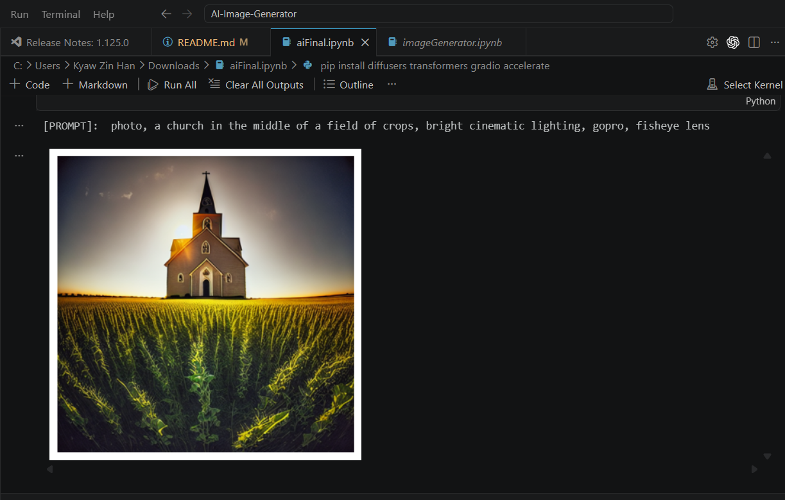

# AI-Image-Generator

## Objectives

- Demonstrate how modern diffusion models can convert natural-language prompts into realistic or artistic images
- Evaluate the performance and usability of pretrained Stable Diffusion models for creative applications.

## Environment

- Python
- PyTorch
- Google Colab

## Features

- Generate images from text prompts
- Use pretrained Stable Diffusion models from Hugging Face
- Support GPU acceleration in Google Colab
- Experiment with inference steps, image size, and multiple outputs
- Save generated images as result files

## Challenges and Limitations

### GPU Resources

- Stable Diffusion needs a powerful GPU. On mid-tier GPUs, performance slows significantly with longer generation times (1-2 Mins)

### Controlling fine-grained details

- Since the model generates images from a textual prompt using learned representations, controlling precise pixel-level detail or specific small objects is challenging.

### Dependence on pretrained model

- Pretrained models biases from their training data, limit creativity. They may also struggle with uncommon or very specific prompts outside their training distribution.

## Results

## Google Colab Link

https://colab.research.google.com/drive/1-dQvc1tLo_ajOxnPXVmqqCywiB1GrZTz?usp=sharing
